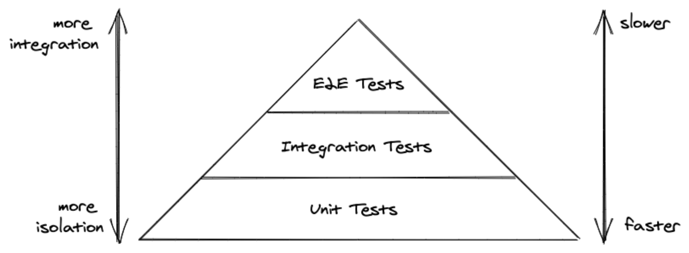

# Intermediate React Notes

- Unit tests are for small, isolated blocks of code, such as a single function or component. 
- Integration tests help us figure out how well these blocks of code work together. 
- End-to-end tests simulate a real-life scenario, like a user logging into a web application.

- There is always the decision to make for JavaScript objects whether you want to make a strict comparison or just a content comparison.
- Most often you only want to have a content comparison here, hence use `toStrictEqual`.
- For JavaScript primitives though, like strings or booleans, you can still use `toBe`.
- A reducer function will always follow the same test pattern: given a state and action, we expect the following new state.
- The getByRole function is used to retrieve elements by aria-label attributes.
- Every time we want to mock a JavaScript function, whether it has been called or whether it received certain arguments, we can use Vitest’s helper function to create a mocked function.
- Using getByText in this instance would produce an error, because the element can’t be found; but with queryByText the value just returns null.
- As a rule of thumb, use getBy for single elements, and getAllBy for multiple elements.
- Snapshot tests as a more lightweight way to test React components and their structure. 
- Essentially a snapshot test creates an instance of your rendered component’s output as HTML elements and their structure.